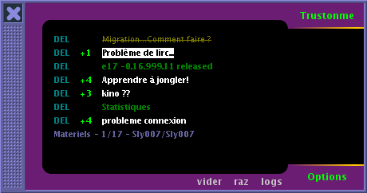
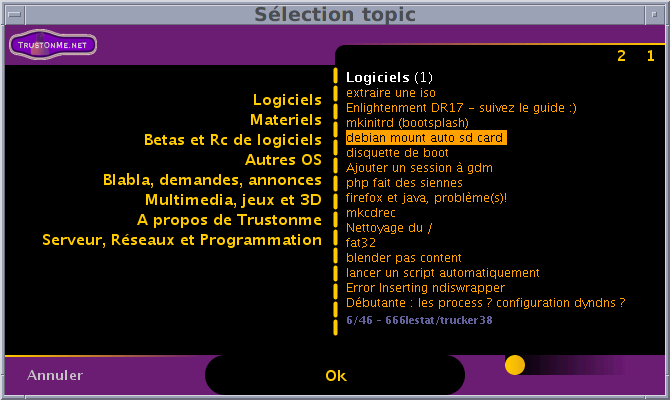

## trustopics

**Description**

`trustopics` is a utility coded in Java that allowed tracking topics on a help site oriented towards Linux and free software.
The site in question http://www.trustonme.net no longer exists today.

  

  

